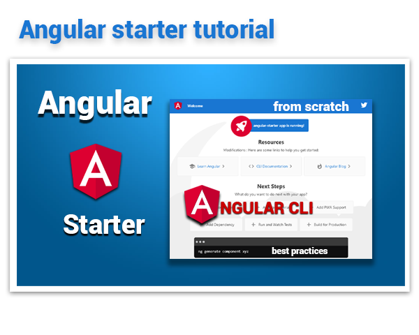

# Angular 15 & React 18 Examples Starter

<table>
<tr>
<td> 
it's part of a repo series designed 


to create a **Web Application with Angular 15**

* Featuring [**Angular 15.2.6**](https://github.com/angular/angular/releases) & [**Angular CLI 15.2.5**](https://github.com/angular/angular-cli/releases/)


* See the [**Angular Live demo**](#angular-live-demo), Test the repo with [**Quick start**](#angular-quick-start) and for more information Read the step by step [**Tutorial**](#angular-tutorial) or read the [**Getting started**](#angular-getting-started)


to create a **Web Application with React 18**


* Featuring [**React 18.2.0**](https://github.com/facebook/react/releases) & [**Create-react-app 5.0.1**](https://github.com/facebook/create-react-app/releases)


</td>
</tr>
</table>
# [Angular Quick start](#angular-quick-start)

```bash
# choose a repo
# download the example or clone the repo from github
git clone https://github.com/ganatan/angular-react-starter.git

# download the example or clone the repo from gitlab
git clone https://gitlab.com/ganatan/angular-react-starter.git

# change directory
cd angular 

# install the repo with npm
npm install

# start the server
npm start

```
in your browser go to [http://localhost:4200](http://localhost:4200) 


# [Angular Tutorial](#angular-quick-start)

Here is a step by step Tutorial :  https://www.ganatan.com/tutorials/getting-started-with-angular

<p align="center">
  <a href="https://www.ganatan.com/tutorials/getting-started-with-angular">
    
  </a>
</p>

# [Angular Getting started](#angular-getting-started)


## Installation
* `npm install` (installing dependencies)
* `npm outdated` (verifying dependencies)

## Development
* `npm run start`
* in your browser go to [http://localhost:4200](http://localhost:4200) 

## Production 
* `npm run build`

## Linter
* `npm run lint`

## Tests
* `npm run test`
* `npm run coverage`

